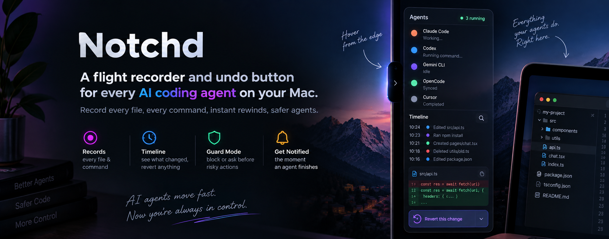

<p align="center">
  
</p>

<p align="center">
  <strong>A flight recorder and undo button for every AI coding agent on your Mac, living in a notch on your screen edge.</strong><br>
  Every file an agent touched and every command it ran, across Claude Code, Codex, Gemini CLI, OpenCode, and Cursor, in one timeline you can scrub, diff, and revert, even after the terminal is closed.
</p>

<p align="center">
  
  
  
</p>

---

## What it is

People run coding agents on the host, not in a sandbox, because that is where the editor, the credentials, and the dev server are. Each agent checkpoints its own file edits, inside its own session, while that session is open. Nothing covers shell commands like `git reset --hard` or `rm -rf`, nothing covers changes outside the project, and nothing covers more than one agent.

Notchd records through the hooks and plugins each agent already supports, snapshots the paths a tool call declares before it runs, diffs them after, and writes an append-only ledger. A revert restores from that store and says `complete` only when every path verified bit for bit. Every fact carries its fidelity: recorded by a hook, derived from a transcript, or seen on the filesystem with no agent claiming it.

It never talks to the network. Nothing leaves the machine.

## The notch

Notchd's ambient surface is a notch on a screen edge. At rest it is a slim glass handle with a green dot while an agent is working. Reach for it and it unfolds into:

- one row per live session: project, agent, when it last did something, and how many files it created, modified, and deleted in the last hour
- the last few files touched by anyone, with your own edits faded
- **Open timeline**, and **Revert last 10 min…**, which opens the timeline with that span selected and the revert sheet up. The notch never reverts on its own; it is always the same two steps

While agents work, one dot per agent breathes slowly on the closed pill. When an agent finishes a turn, its dot hops, the pill peeks out into a short tab for three seconds showing that agent's mark, the project name, and the change marks such as `+1 ~2`, then folds back. The trackpad taps once and a macOS notification arrives at the same time, with no sound; clicking it opens the session. Each of the three is a switch in Settings, a fourth decides whether a plain reply with no tool calls counts, and every movement respects Reduce Motion.

Click the open notch to pin it, right-click for the menu. Settings offers the four edges and three visibilities: always open, open on hover, hidden. On a MacBook the top placement takes the hardware notch's exact shape, so at rest there is nothing extra on screen and hovering grows the notch itself.

## The timeline

The window shows time left to right with one lane per session plus a lane for changes no agent claimed. Every change is a tick coloured create, modify, or delete: solid when a hook recorded it, dashed when it was derived from a transcript, faded when nobody claimed it. Drag across lanes to select a span. The inspector lists the files in it with their net change, shows a line diff of the one you pick, and names the tool calls behind them.

Revert is two steps. The sheet lists each path with a tick, leaves impossible ones unticked with the reason, states which shell commands cannot be fully undone, and after confirmation reports complete or partial with every failure named. The current state is checkpointed first, so a revert can itself be reverted.

Click a lane to open the session as a log of prompts, tool calls, and the files each changed.

## Agents

| Agent | How | Fidelity |
|---|---|---|
| Claude Code | Command hooks in `~/.claude/settings.json` | Recorded by hook |
| Gemini CLI | Command hooks in `~/.gemini/settings.json`, Gemini's documented format | Recorded by hook |
| OpenCode | A plugin file in `~/.config/opencode/plugin/` | Recorded by hook |
| Cursor | Entries in `~/.cursor/hooks.json`, Cursor's documented format | Recorded by hook. File edits arrive after the fact and are compared with the last copy Notchd has |
| Codex | Follows the transcripts under `~/.codex/sessions`; Codex has no tool hooks | Derived. The call is matched to its changes afterwards |
| Anything else | The [protocol](PROTOCOL.md): one JSON object into `notchd-hook emit` | Whatever you declare |

Settings shows exactly what each integration will write, and writes it only when you click Install. Remove puts the file back as it was. The Gemini CLI and Cursor integrations follow those tools' documented formats and have not yet been checked against a live install of either.

## Guard mode

Off by default. Turn it on in Settings and Notchd checks every hook-recorded tool call against rules you write before it runs: a glob over the paths the call declares, or over its command line, with an action. **Deny** refuses the call and tells the agent why. **Ask** hands the call to the agent's own permission prompt. The first switch-on seeds a few rules to edit or delete: no touching `~/.ssh`, `~/.aws`, or `~/.gnupg`; never `rm -rf /`; ask before `rm -rf`, `git reset --hard`, a forced push, or `sudo`.

Two limits, stated plainly. Codex cannot be guarded, because Notchd learns of its calls from the transcript after they run. And guard mode is not a sandbox: it sees only what agents declare, and only the rules you wrote.

## How it works

```
 agents ──hooks / plugins──▶ notchd-hook ──unix socket──▶ Notchd.app ──▶ ledger.sqlite
                                                              │              store/ (content-addressed)
 filesystem ──FSEvents────────────────────────────────────────┘
 Codex transcripts ──tailed───────────────────────────────────┘
```

- `notchd-hook` is a tiny binary inside the app bundle. An agent invokes it as a hook. It forwards the agent's JSON to the socket, waits for the app to say the checkpoint is taken, and exits 0. It exits 0 on every failure too, including Notchd not running, so it can never block a tool call.
- Before a mutating call the app snapshots the declared paths: the file for an edit tool, the working directory for a shell tool. After the call it snapshots again and records each created, modified, or deleted path with the hashes of both versions.
- FSEvents watches the working directories of active sessions. A file that changes while no tool call is open lands in the unattributed lane. Reverts leave that lane alone unless asked.
- Copies older than 30 days are pruned from the store. Ledger rows never are; a change whose copy is gone says so at revert time.

## The command line

The CLI lives inside the app bundle. Symlink it once:

```sh
ln -s /Applications/Notchd.app/Contents/Helpers/notchd /usr/local/bin/notchd
```

```sh
notchd sessions
notchd changes --last 10m [--session ID] [--unattributed]
notchd revert  --last 10m [--session ID] [--unattributed] [--dry-run] [--yes]
```

A revert prints what it will restore, lists the shell commands in the range whose non-file effects it cannot undo, asks for confirmation, and exits 0 for complete, 2 for partial, 1 for an error.

## Install

Requires macOS 26 on Apple silicon.

Download `Notchd.dmg` from the [latest release](https://github.com/MuhammadHananAsghar/notchd/releases/latest), open it, and drag Notchd to Applications. The disk image is signed but not notarized, so the first launch stops at "Apple could not verify Notchd". Open System Settings > Privacy & Security, click **Open Anyway**, and launch it again, or clear the quarantine flag once:

```sh
xattr -dr com.apple.quarantine /Applications/Notchd.app
```

Notchd checks for updates itself and installs them in place. Or build it yourself:

```sh
brew install xcodegen
git clone https://github.com/MuhammadHananAsghar/notchd.git
cd notchd
make run
```

Notchd appears on the right edge of the screen and in the menu bar. On first launch it opens Settings, where each agent has a card.

Run with `NOTCHD_HOME=/some/dir` to keep a development copy's ledger, store, and socket apart from an installed one. The hook and the CLI honour the same variable. The directory must be short enough for a unix socket path. `NOTCHD_CODEX_SESSIONS=/some/dir` points the Codex tailer at a scratch directory.

## Building

```sh
make run          # generate the project, build, and launch a Debug build
make test         # unit tests; ONLY=NotchdTests/SomeSuite runs one suite
make dmg-local    # a drag-to-Applications disk image, no Developer ID needed
```

No signing identity is needed to build or test. Diagnostics go to the unified log:

```sh
log stream --predicate 'subsystem == "com.muhammad.notchd"' --level debug
```

## Invariants

1. Never display a fidelity higher than the source supports.
2. Never write to an agent's configuration without showing the exact text first.
3. Never block a tool call because of a Notchd failure.
4. Never report a revert as complete unless every path in scope was restored bit for bit.
5. Never leave the machine: no network code in any target.

## What a snapshot skips

Files over 50 MB, more than 20,000 files per checkpoint (the checkpoint is marked truncated), and directories named `.git`, `node_modules`, `build`, `DerivedData`, `.venv`, and similar. The home directory, the filesystem root, and system trees are never snapshotted or watched.

## Architecture

```
Sources/
  Hook/          notchd-hook, Darwin only
  CLI/           notchd: sessions, changes, revert
  Core/
    Protocol/    NotchdEvent, Envelope, JSONValue, Fidelity
    Adapters/    Claude Code, Gemini CLI, Cursor, the native adapter, the Codex parser and tailer
    Ledger/      SQLite wrapper, Ledger, NotchdPaths
    Snapshot/    ObjectStore, Manifest, Snapshotter, StorePruner
    Recorder/    Recorder (checkpoint and diff), FileActivityWatcher (FSEvents)
    Revert/      RevertEngine, LineDiff, DurationText
    Guard/       GuardRule, GuardPolicy
    Server/      EventSocketServer, EventIngest
    Hooks/       AgentIntegration, HookSettings, the OpenCode plugin, Cursor's hooks file
  App/           AppDelegate, StatusItemController, Updater, Views/
  Notch/         edge geometry, shape, panel, view model, root view, window controller
  Settings/      Preferences
  DesignSystem/  Palette, Typography, Surface
Tests/
examples/        Python, TypeScript, shell, and a minimal agent
```

## License

MIT.
